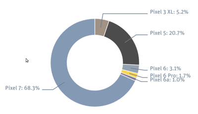
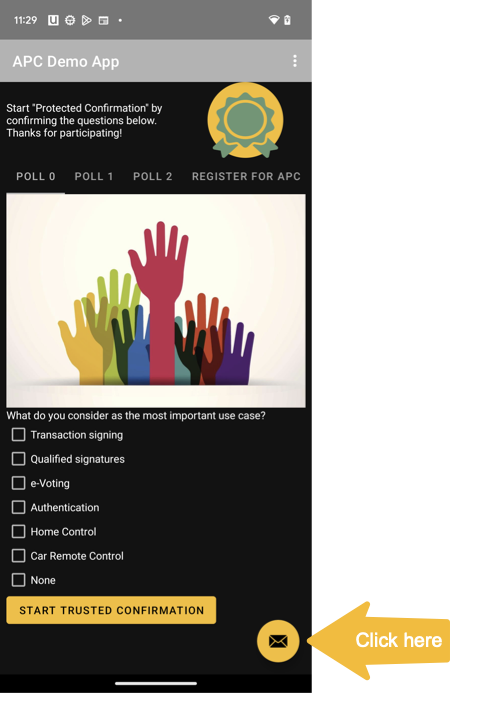

# APC Demo App

<a href="https://play.google.com/store/apps/details?id=ch.bfh.securevote"></a> 

## About
This code serves as demo implementation for using and testing [Android Protected Confirmation (APC)](https://developer.android.com/training/articles/security-android-protected-confirmation).

Find an abstract of our objectives on https://apc.ti.bfh.ch.


## Usage
[APC](https://source.android.com/docs/security/features/protected-confirmation) is an optional Android standard since Android 9 (API level 28).
To our knowledge it is only implemented on Pixel 3+ devices.
The following devices have been tested successfully:
 * Pixel 3 XL
 * Pixel 5
 * Pixel 6
 * Pixel 6a
 * Pixel 6 Pro
 * Pixel 7


You will find real-time statistics of all participating devices [on our web site](https://apc.ti.bfh.ch/stats/model_stats.html).

<a href="https://apc.ti.bfh.ch/stats/model_stats.html" target="_blank" alt="Screenshot"></a>

Please report back if you find any other devices!

## Build
```
./gradlew build
```

## Testing
The demo code allows to test APC with
 * various trust stores such as Secure Element (SE) and TEE trust store.
 * various asymmetric key pairs such as RSA and EC key pairs. Note that the key selection is limited by the key store. Each key store has only a limited selection of key types and supported key lengths.
 * various messages to be APC confirmed. APC allows only messages of a certain length containing a reduced set of characters. Special character sets or emojis are not supported. Basically, messages which cannot be displayed properly on the [Trusted UI](https://source.android.com/docs/security/features/protected-confirmation) will be refused and therefore cannot be APC confirmed.

## 3rd party library
To parse the attestation extension on the Android device we used the code from https://github.com/google/android-key-attestation. The code -intended for the server-side validation of attestation certificates- has been slightly adapted to display the attestation extension locally on the Android device. A full attestation chain can be found on [our info web site](https://apc.ti.bfh.ch/api/attestation_chain.html).

## Contact
Reach out via:
 * Github
 * The APC Demo App:


